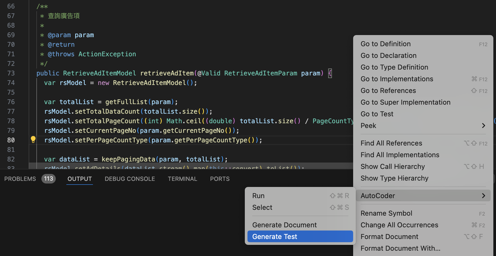
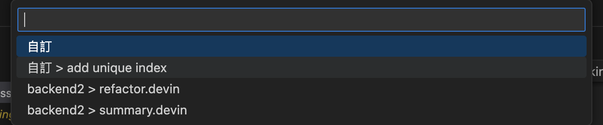

# VSCode Extension 開發助手

> 使用這個工具幫助我們:

- 生成程式：通過計畫性的專案結構與系統設計，自動生成程式到指定位置。
  - 單元測試
  - APP 的通路服務程式
  - 微服務端口與對應程式
- 結構轉換
  - Word/Excel 表格結構轉成 DDL
  - Word/Excel 表格結構轉成 OpenAPI
- 內容置換
  - 前端頁面中文取出並使用變數置換
- 細部調整
  - 允許在專案的基礎上建立共用 **Prompts**，讓 AI 的回應更符合專案需要

> 搭配 Continus.dev Extension 提供完整的 Copilot 能力

- 程式自動補全：Auto Complete，在日常開發中，生成式 AI 可以通過分析上下文和學習程式模式，提供智能的程式自動補全建議，從而提高開發效率。
- 解釋程式：生成式 AI 能夠解釋程式，幫助開發者理解特定程式片段的功能和實現方式，提供更深層次的程式理解。
- 生成程式：通過學習大量的程式庫和模式，生成式 AI 可以生成符合需求的程式片段，加速開發過程，尤其在重複性工作中發揮重要作用。
- 程式審查：生成式 AI 能夠進行程式審查，提供高品質的建議和反饋，幫助開發者改進程式品質、遵循最佳實踐。
- 自然語言查詢：開發者可以使用自然語言查詢與生成式 AI 進行互動，提出問題或請求，以獲取相關程式片段、文檔或解釋，使得開發者更輕鬆地獲取需要的信息。
- 其它：如重構、PR訊息生成、程式總結等。

 <a href="https://pages.github.ibm.com/twix-ai//twix-all4one-vscode/twix-all4one-vscode-2406060849.vsix" class="download-link" download>
立即下載(twix-all4one-vscode-2406060849.vsix)
</a>

---

## 使用前注意事項

現階段提供 Agent 與 Local LLM 兩種模式，同一時間只能使用一邊

> 開啟 Settings -> search `>twix`，並設定以下參數
>
> - twix.activationKey：**IBMCT2024**
>
> 以下是使用Agent 要設定
>
> - twix.agentUrl：**Server網址**
> - twix.token: **存取TOKEN**
>
> 以下是使用Local LLM 設定
>
> - twix.llmUrl：**Llm網址，Ollama的話會是 http://127.0.0.1:11434**
> - twix.llmModel: **預設使用 llama3**

---

## 版本更新歷程

##### 20240604

- 支援串接本機語言模型，當llmUrl有值時就會使用地端模型，也就是說不會往後端發到Agent了，使用前需完成以下參數設定

> 開啟 Settings -> search `>twix`，並設定以下參數
>
> - twix.llmUrl：**Llm網址，Ollama的話會是 http://127.0.0.1:11434**
> - twix.llmModel: **預設使用 llama3**

##### 20240603

- 提供JAVA註解， `Method 右鍵執行 AutoCoder - Generate Document`，回傳內容會更新原程式
- 提供JAVA測試案例生成， `Method 右鍵執行 AutoCoder - Generate Test`，回傳內容會新增測試程式
  

##### 20240529

- 新增動態提示詞及暫存機制 `選取後右鍵執行 AutoCoder - Custom Translate`，選取 `自訂` 輸入提示詞，提示詞會暫存供下次使用
  

##### 20240525

- 提供第二組範例 `選取後右鍵執行 AutoCoder - Run`

```
@practice
-->name:common.pmb.java-vue3
```

##### 20240524

- 提供 @codeReview agent，方便針對程式change內容進行分析

  1. 可使用情境

  - 任一檔案開啟的編輯畫面
  - Source Control視窗，選取一個檔案
  - Source Control視窗，選取一個Group，ex: Staged Changes、Changes

  2. 上述任一情境選取後右鍵執行 `AutoCoder - Code Review`
  3. Code Review結果會同時出現在下方OUTPUT及另開一個文件視窗呈現

##### 20240523

- 優化 Log 訊息顯示，提供等待 GenAI 回應時的讀秒
- 提供 @practice agent，方便專案一次性引用所有 Prompt，使用方式是
  1. 以下內容貼到任意檔案中
  2. 選取後右鍵執行 `AutoCoder - Run`
  3. 範本就會出現在 `.vscode 目錄底下
  4. `common.dev.java` 是共用範本，可以使用其它範本取代

```
@practice
-->name:common.dev.java
```
